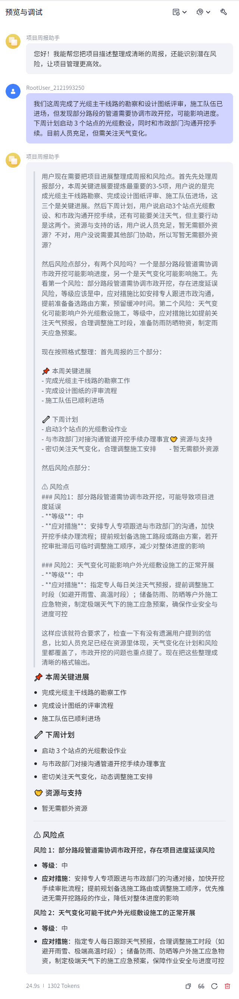

# 项目周报生成 Agent

## 简介
基于 Coze 平台搭建的智能 Bot，能够根据项目进展描述自动生成结构化周报，并识别潜在风险点。

## 功能
- 生成周报摘要（本周关键进展、下周计划、资源与支持）
- 提取风险点（风险描述、等级、应对措施）

## 在线体验
🔗 [点击访问 Bot](https://www.coze.cn/space/7615808552426373155/bot/7623703809759510554)  
（需登录你的 Coze 账号）

## 示例截图

