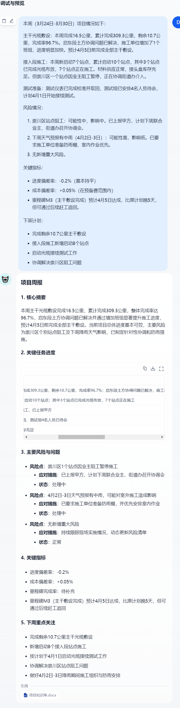

# 项目周报生成 Bot —— 基于 Dify 的智能项目助理

## 项目简介

这是一个基于 **Dify** 平台搭建的智能问答机器人，专为通信/工程项目经理设计。它能够根据上传的项目文档（周报、WBS、风险清单等）**自动生成结构化的项目周报**，并支持针对项目进度、风险、指标等问题的即时问答。

该作品是我在转型 **AI 解决方案架构师** 过程中的第一个实战项目，旨在展示如何利用低代码/零代码 AI 工具快速解决实际业务痛点。

- **在线体验**：[(https://udify.app/chat/G03cYVLNhEkZmv1t)]
- **测试截图**：
---

##  业务背景与痛点

在通信/工程项目管理中，每周撰写周报是一项繁琐但必要的工作：
- 需要从多个 Excel、Word、邮件中汇总信息
- 格式要求统一，数据需准确
- 耗时约 1-2 小时/周

**本 Bot 的作用**：将周报撰写时间缩短至 **5 分钟**，并确保格式规范、数据一致。

---

##  技术实现

### 使用平台
- **Dify**：开源 LLM 应用开发平台（https://dify.ai）
- **底层模型**：OpenAI GPT-3.5 / GPT-4（可通过 Dify 配置）
- **知识库**：内置向量检索，支持多文档分段与召回

### 核心配置
| 组件 | 配置说明 |
| **知识库** | 上传了 10+ 份历史周报、项目 WBS、风险登记册、里程碑计划 |
| **分段策略** | 自动分段，长度 500 字符，重叠 100 字符 |
| **检索参数** | 相似度阈值 0.35，检索数量 8 条，开启关键词增强 |
| **提示词** | 定制 System Prompt（角色扮演 + 严格输出格式 + 示例） |

### 工作流（Workflow）设计
```mermaid
graph LR
A[用户输入：“生成本周周报”] --> B[检索知识库]
B --> C[召回相关文档片段]
C --> D[LLM 根据提示词生成周报]
D --> E[输出 Markdown 格式周报]


